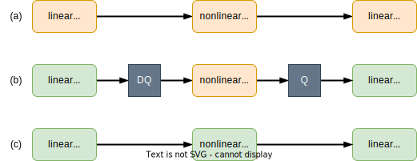

# 基于查表法的激活函数量化

## 前言

该项目想基于查表法实现激活函数量化。因为目前没有实际负载的实现，所以标注为“口嗨版”。当然后续会抽空做实际负载的实验（目标是 Transformer），争取早日抹掉这个标注。不过实现的单个量化算子，都提供了测试用例。
项目地址：<https://github.com/yehangyang/Table_Based_Quantization>

## 动机

首先交代一下激活函数量化的需求从何而来。为了提高模型推理速度，一些算子被做成量化算子，在整型域上进行计算（e.g. int8 量化，还有更激进的 int4 量化）。通常情况下线性计算实现量化是比较简单的，因为不是本文讨论重点，这里不做赘述。

而在模型设计中，线性层的后面通常会跟一个非线性层（也就是所谓的激活函数）。例如现在有下图（a）这样一个模型。如果只能对线性层做量化，那么只能得到下图（b）这样的效果，量化和非量化算子之间会穿插很多 Q/DQ 节点（也就是量化和浮点间的转化）。而我们希望看到下图（c）的效果，也就是希望激活函数也能进行量化计算。




## 计划

| Function |  Status |
|:--------:|:-------:|
|  Sigmoid | &#10004 |
|   TanH   | &#10004 |
|  Softmax | &#10004 |


## 运行

### Unit Test

进入项目根目录，运行以下指令，

```shell
python -m unittest
```
